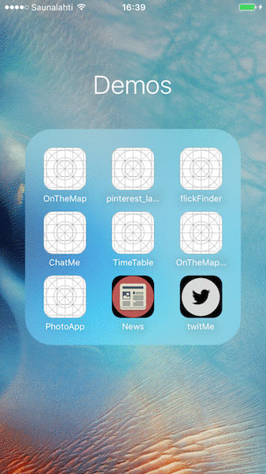

# README.md

## Introduction:

* This project fetches tweeter data for given word/tag/user

## Learning Objective:

* Here the objective is primarily to demonstrate use of Table View for more complex use cases

## How to use:

* Open "twitMe" application

## Technical Highlights:

* Custom TableViewCell
* AutoLayout
* Asynchronous Programming for fetching data from internet
* NSDateFormatter
* TextField Delegate
* Pull To Refresh

## Status:

* Complete.

## Desired Further Enhancement:

## Notes:
* Icon downloaded from (http://www.myiconfinder.com/uploads/iconsets/624dc72b6deef6abddf29031c1ac7224.png)
* Gif created with (http://www.ezgif.com)
